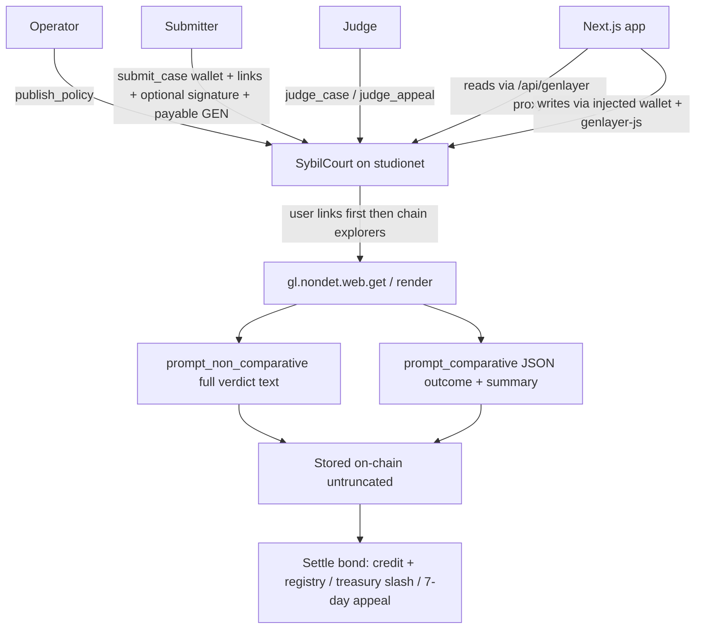

# Sybil Court

A GenLayer Intelligent Contract and Next.js dApp. An operator publishes a full eligibility policy. Someone submits a wallet with public evidence links, optionally signs a control statement, and locks a payable GEN bond. Validators fetch those pages and store a **full written verdict** on-chain.

Outcomes are **Eligible**, **Ineligible**, or **Contested**. The court does not invent transactions, balances, or identity. A signature is not identity. If a source fails or is thin, the verdict says so.

## Live

| | |
|---|---|
| App | [https://sybil-court.vercel.app](https://sybil-court.vercel.app) |
| Repo | [https://github.com/edwarderlick/Sybil-Court](https://github.com/edwarderlick/Sybil-Court) |
| Network | GenLayer studionet (chain `61999`) |
| **Current contract** | [`0x114F72F1b65f60d8ed9244B573F0c7F3a980814B`](https://sybil-court.vercel.app/cases/CASE-0002) |
| Current docket | [CASE-0001 unsigned](https://sybil-court.vercel.app/cases/CASE-0001) · [CASE-0002 signed Contested](https://sybil-court.vercel.app/cases/CASE-0002) |
| Previous bonded contract | `0x573ae3ba443fc3b5bAA52b9B1030c4eA0c0cf69c` (Eligible / Ineligible / appeal proofs; not what the live app reads) |

Connect an injected wallet, switch to studionet if prompted, then **Publish → Submit → Judge**. Submit and appeal send real payable GEN. Studio fees are gasless.

Steward resubmission answers are in [RESUBMISSION.md](./RESUBMISSION.md).

## How it works



1. **Publish a policy.** The full body is stored. Gemini can draft; the operator must Accept, Edit, or Discard before anything is written.
2. **Submit a wallet.** Target address, up to five HTTPS links, optional signed control statement. At least **0.01 GEN** is sent with the transaction and locked.
3. **Run judgment.** Validators fetch the pages, write the full verdict, then settle the bond.
4. **Read the docket.** Outcome, bond status, registry listing, appeal window, signed statement if any, and the exact stored verdict text.

Judgment is two consensus rounds. Several minutes is normal. Keep the tab open.

## Bonds and settlement

These are real payable locks on studionet, not UI labels.

| First outcome | What the contract does |
|---|---|
| **Eligible** | Submit bond becomes an on-contract **credit**. Target wallet is listed in `eligible_wallets`. |
| **Ineligible** | Submit bond is **slashed to the treasury**. Wallet is cleared from the registry. |
| **Contested** | Bond stays **locked**. A **7-day** appeal window opens. Appeal requires **2×** the submit bond, also payable. |

Appeal settlement:

| Appeal outcome | Submit bond | Appeal bond |
|---|---|---|
| Eligible | returned as credit; wallet listed | returned as credit |
| Ineligible | slashed to treasury | returned as credit |
| Contested | returned as credit | returned as credit |

`withdraw()` tries to pay a credit out natively. **Studio may not complete that payout** (no ghost/EVM layer). Credits are real contract balances; they are not a guaranteed native transfer.

## Signed control statement

Optional. Skip and the old unsigned path still works.

The connected wallet signs a plain EIP-191 message that names the contract, policy id, target wallet, and signer, plus an honest limit. `submit_case` stores `control_message`, `control_signature`, and `control_signer`. `get_case` exposes them.

| It does | It does not |
|---|---|
| Bind a specific signing key to this filing | Prove legal identity, uniqueness, or humanity |
| Let the verdict quote the stored signer and message | Recover the signer on-chain (the contract stores the bytes) |
| Show whether the signer string equals the target | Replace fetched public pages as Eligible proof |

If the connected key is not the target wallet, the UI says so. A signature is never enough for Eligible.

## Evidence gathering

User links first (max 5). Then up to three public explorers for the chain named in the policy, or inferred only from a distinctive wallet shape.

1. Phrases in the **policy title, policy body, and user URLs** (first match wins).
2. If the text is silent, a **Solana** base58 wallet (32–44 chars) selects Solana.
3. Otherwise **Ethereum**, and only if the wallet is `0x` + 40 hex.

A 64-hex address is Sui *or* Aptos, so that shape is never guessed. A Solana or Sui policy does not fall back to Ethereum explorers.

| Detected chain | Automatic explorers |
|---|---|
| Solana | OKLink Solana, Solscan, Solana.fm |
| Sui | OKLink Sui, Suiscan, Suivision |
| Aptos | OKLink Aptos, Aptos Labs explorer, Aptoscan |
| Base | OKLink Base, Blockscout Base, Basescan |
| Arbitrum | OKLink Arbitrum One, Blockscout Arbitrum, Arbiscan |
| Optimism | OKLink Optimism, Blockscout Optimism, Optimistic Etherscan |
| ZKsync | OKLink ZKsync, Blockscout ZKsync, explorer.zksync.io |
| Polygon | OKLink Polygon, Blockscout Polygon, Polygonscan |
| Ethereum (default) | OKLink Ethereum, eth.blockscout, Etherchain |

| Label | Meaning |
|---|---|
| `SOURCE` / fetched | Readable public HTML was retrieved |
| `FETCH_THIN` | Challenge wall, title-only stub, or almost no text |
| `FETCH_FAILED` | HTTP error, DNS failure, or empty body |

Fetch text is clipped at 5,000 characters per source for the prompt. **The stored verdict is not clipped.**

## Outcomes

The written verdict uses `prompt_non_comparative` (policy + control statement + fetched text). The label uses `prompt_comparative` on JSON `{ outcome, summary }`. The `outcome` field must match.

| Outcome | When the contract may use it |
|---|---|
| **Eligible** | Fetched pages themselves clearly satisfy the policy’s uniqueness / non-sybil test |
| **Ineligible** | Fetched pages themselves clearly show farming, clusters, or other policy-defined sybil behavior |
| **Contested** | Required proof is missing, sources failed or are thin, or the record is off-topic / contradictory |

A biography, homepage, or explorer interstitial is not uniqueness proof. Eligible required a fetched page that named the person **and** printed the exact address. Ineligible required a fetched page that named the wallet as a cluster parent.

## Proofs

The live app reads **only** the current contract. Prefer those two dockets first.

### Current contract — `0x114F72F1b65f60d8ed9244B573F0c7F3a980814B`

Deploy: `0xb42c319191c23b9615beab9174571735d8c861f5bbc7b28c37ff3549bc44e396`

| Case | Outcome | Bond | Control statement |
|---|---|---|---|
| [CASE-0001](https://sybil-court.vercel.app/cases/CASE-0001) | not judged | locked 0.01 GEN | none — unsigned path still works |
| [CASE-0002](https://sybil-court.vercel.app/cases/CASE-0002) | **Contested** | locked; 7-day appeal open | present; signer matches target; 6,326-character verdict names the signature |

This contract has no Eligible or Ineligible judgment yet. `eligible_count` is `0`. Treasury is `0`.

| Step | Result | Transaction |
|---|---|---|
| `publish_policy` | POL-0001 | `0x922144d9587faed42959a65133861231cd2068fc2516ec6e57b09bdd155feef5` |
| `submit_case` | CASE-0001 unsigned | `0x723fb3308eb3be0782d93242f974611cd22d02d3bbcef8d2c1873e087469f050` |
| `submit_case` | CASE-0002 signed | `0xf31836e3ca61751f89f7dbfd5f1433d099fae819d591b97d88a06fbc17a2337c` |
| `judge_case` | CASE-0002 Contested | `0x6694e191bd69387bdd610e3aecf80a8837d9e938b43a7a2b8f2ab499b78a281b` |

### Previous bonded contract — `0x573ae3ba443fc3b5bAA52b9B1030c4eA0c0cf69c`

Same bond, registry, slash, and appeal code. **No signed control statements.** The live frontend does not read this address. Settlement proofs below are on-chain reads of that contract.

Deploy: `0x3c9098960f9093be9d4d99d47642fa3217ae052cef9fd21977f69ea8fe4261f8`

| Case | Outcome | Bond / registry |
|---|---|---|
| CASE-0001 | **Eligible** | returned as credit; `is_eligible(0xd8dA6BF2…A96045)` is true |
| CASE-0002 | **Ineligible** | slashed; treasury `0.01 GEN` |
| CASE-0003 | **Contested**, appeal **Contested** | both bonds returned as credits |

| Step | Result | Transaction |
|---|---|---|
| `submit_case` | CASE-0001 locked 0.01 GEN | `0xe48a3463744772033b194b46cd2acef30fbb79f1ffe77be053879f5714426bb4` |
| `judge_case` | Eligible, bond returned | `0x52f2dab5524ce38e3d6d208df011830bdc49480079eae51bad4186eb1f333d5c` |
| `submit_case` | CASE-0002 locked 0.01 GEN | `0x8a1a92a959211b0db01501e90f12d55616aebe0e9d074136126af2bae8748748` |
| `judge_case` | Ineligible, slashed | `0xc02a56e18cc79197baeba3e2f23fe5ad8e17cfc27178b92d7910a5f9fe41d595` |
| `submit_case` | CASE-0003 locked 0.01 GEN | `0xb903b92473e7621665cb89d5bf55014745ae72c75b2f75b8fed180636b5ef5d5` |
| `judge_case` | Contested, window opened | `0x3e808a938838d7d56e81b4cd854edcc2a6acc37e5f5644bf240718ba0f052733` |
| `file_appeal` | 0.02 GEN locked | `0xaff01ce202d1ecba0b815a5b6847cf09b34521437df16beffdade1257cd11c25` |
| `judge_appeal` | Contested, both refunded | `0xd09766e3076784a0d0a2f67a903babb2638161fbd408afb72101efacb8cf9714` |

## Contract surface

`contracts/sybil_court.py` — runner `py-genlayer:1jb45aa8ynh2a9c9xn3b7qqh8sm5q93hwfp7jqmwsfhh8jpz09h6`

| Method | Kind | Role |
|---|---|---|
| `publish_policy(title, body, project, source)` | write | Store the full policy |
| `submit_case(..., control_message, control_signature, control_signer)` | write | Open a case. Control fields may be empty. |
| `judge_case` / `judge_appeal` | write | Verdict, then bond settlement |
| `file_appeal` | write | Contested only, inside the 7-day window, 2× bond |
| `get_case` | view | Docket, links, control statement, verdict |
| `is_eligible` / `get_bond_status` / `get_economics` | view | Registry, lock/return/slash, treasury |
| `finalize_expired_appeal` | write | Return a locked bond after the window |
| `withdraw` | write | Attempt credit payout (Studio may not pay natively) |
| `list_policy_ids` / `list_case_ids` | view | Indexes |

Wallet is a `str`, so Solana pubkeys and Sui 32-byte hex addresses are valid.

## Architecture

```
Browser (injected wallet)
  │
  ├─ UI reads  ──► /api/genlayer  ──► https://studio.genlayer.com/api
  │
  ├─ UI writes ──► genlayer-js + window.ethereum ──► studionet
  │                 submit_case / file_appeal send msg.value
  │
  └─ Publish draft ──► /api/recommend-policy ──► Gemini (optional)

SybilCourt
  publish / submit / appeal     deterministic storage + payable lock
  judge_case / judge_appeal     nondet fetch + two equivalence helpers + settle
```

Studio CORS is not reliable from a web origin, so the app proxies JSON-RPC through `app/api/genlayer/route.ts`. `FINALIZED` means the network accepted the transaction. The frontend still checks the leader `execution_result`.

## AI policy recommendation

`POST /api/recommend-policy` calls Gemini (`gemini-2.5-flash`) with a server-only `GEMINI_API_KEY`. The draft is not stored until the operator accepts or edits it. Gemini is not used for judgment. Missing key → HTTP 503 with a real error.

## Run locally

Requires Node 20+ and an injected wallet for writes.

```bash
cp .env.example .env.local
npm install
npm run dev
```

```
NEXT_PUBLIC_GENLAYER_RPC=https://studio.genlayer.com/api
NEXT_PUBLIC_GENLAYER_CHAIN_ID=61999
NEXT_PUBLIC_SYBIL_COURT_ADDRESS=0x114F72F1b65f60d8ed9244B573F0c7F3a980814B
GENLAYER_RPC=https://studio.genlayer.com/api
GEMINI_API_KEY=
```

Leave `GEMINI_API_KEY` blank if you do not need policy drafts.

```bash
genlayer network set studionet
genlayer deploy --contract contracts/sybil_court.py
```

## Limitations

- **No native chain RPC.** Studio has no usable `@gl.evm.contract_interface` for Ethereum, and no Solana or Sui RPC. Evidence is public HTML only.
- **Explorers often fail.** Cloudflare walls, 403s, 404s, and SPA shells stay `FETCH_THIN` or `FETCH_FAILED`.
- **Eligible / Ineligible are strict.** A biography without the wallet stays Contested.
- **Signature is not identity.** The contract stores the signed bytes. It does not recover the key.
- **Credits ≠ native payout.** Refunds are on-contract credits. `withdraw()` may not pay out on Studio.
- **Judgment is slow.** Two consensus rounds. Studio writes can hit 30 req/min.
- **Landing, passport, and leaderboard** still use the original Stitch visual language. The live path is Policy, Submit, Cases, Appeal, Activity, and the docket.

## Repo map

| Path | Role |
|---|---|
| `contracts/sybil_court.py` | Policy, case, bonds, signature fields, fetch, both helpers |
| `lib/contract.ts`, `lib/genlayer.ts` | Frontend read/write client |
| `lib/controlStatement.ts` | Optional EIP-191 message builder |
| `lib/verdictView.ts` | Presentation-only verdict parser |
| `app/api/genlayer/route.ts` | Studio JSON-RPC proxy |
| `app/api/recommend-policy/route.ts` | Gemini policy draft |
| `scripts/sign-smoke.mjs` | Unsigned + signed submit, then judge |
| `scripts/bond-smoke.mjs` | Earlier Eligible / Ineligible / appeal smoke (previous contract) |

## Tech stack

- GenLayer Intelligent Contract (Python, pinned runner)
- Next.js 15, React 19, TypeScript
- genlayer-js 1.1.8, wagmi injected connector, viem
- Gemini 2.5 Flash (policy draft only)
- Vercel (frontend + RPC proxy)
