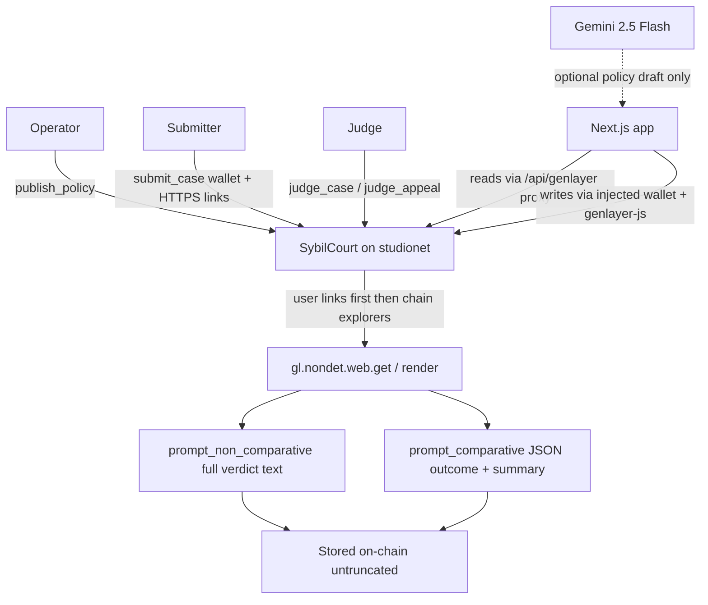

# Sybil Court

Sybil Court is a GenLayer Intelligent Contract plus a Next.js dApp. An operator publishes a full eligibility policy, someone submits a wallet with public evidence links, and validators fetch those pages and store a full written verdict on-chain.

Outcomes are **Eligible**, **Ineligible**, or **Contested**. The court does not invent transactions, balances, or identity. If a source fails or is thin, the verdict says so.

## Live

| | |
|---|---|
| App | [https://sybil-court.vercel.app](https://sybil-court.vercel.app) |
| Repo | [https://github.com/edwarderlick/Sybil-Court](https://github.com/edwarderlick/Sybil-Court) |
| Network | GenLayer studionet (chain `61999`) |
| Contract | [`0xFCA5d6960da9833f241c98f5677a0284534B7723`](https://sybil-court.vercel.app/cases/CASE-0001) |
| Example docket | [CASE-0001](https://sybil-court.vercel.app/cases/CASE-0001) (Solana, Contested) · [CASE-0002](https://sybil-court.vercel.app/cases/CASE-0002) (Sui, Contested) |

Studio is gasless. Connect an injected wallet, switch it to studionet if prompted, then Publish Policy → Submit Wallet → Run Judgment.

## How it works



1. **Publish a policy.** The full body is stored. The Publish page can ask Gemini for a draft; the operator must Accept, Edit, or Discard before anything is written on-chain.
2. **Submit a wallet.** Target address plus up to five user HTTPS links (JSON array, newlines, or inline URLs). Optional bond is recorded in GEN (18 decimals). Studio does not charge gas.
3. **Run judgment.** `judge_case` (or `judge_appeal`) copies the packet out of storage, fetches evidence, writes the full verdict, then settles the outcome.
4. **Read the docket.** The case page shows the outcome badge, summary, evidence inventory, and the exact stored verdict text.

Judgment is two sequential consensus rounds. Several minutes is normal. Keep the tab open.

## Evidence gathering

User-supplied links are always fetched first (max 5). If the wallet matches the detected chain, the contract then tries up to three public explorer pages.

Detection order:

1. Conservative phrases in the **policy title, policy body, and user URLs** (first match wins).
2. If the text is silent, a **Solana** base58 wallet (32–44 chars) selects Solana.
3. Otherwise **Ethereum**, and only if the wallet is `0x` + 40 hex.

A 64-hex address is Sui *or* Aptos, so that shape is never guessed. The policy must name the chain. A Solana or Sui policy does not fall back to Ethereum explorers.

| Detected chain | Automatic explorers |
|---|---|
| Solana | OKLink Solana, Solscan, Solana.fm |
| Sui | OKLink Sui, Suiscan, Suivision |
| Aptos | OKLink Aptos, Aptos Labs explorer, Aptoscan |
| Base | OKLink Base, Blockscout Base, Basescan |
| Arbitrum | OKLink Arbitrum One, Blockscout Arbitrum, Arbiscan |
| Optimism | OKLink Optimism, Blockscout Optimism, Optimistic Etherscan |
| ZKsync | OKLink ZKsync, Blockscout ZKsync, explorer.zksync.io |
| Polygon | OKLink Polygon, Blockscout Polygon, Polygonscan |
| Ethereum (default) | OKLink Ethereum, eth.blockscout, Etherchain |

Each source is labeled honestly:

| Label | Meaning |
|---|---|
| `SOURCE` / fetched | Readable public HTML was retrieved |
| `FETCH_THIN` | Challenge wall, title-only stub, or almost no text |
| `FETCH_FAILED` | HTTP error, DNS failure, or empty body |

Readable fetch text is clipped at 5,000 characters per source for the prompt budget. **The stored verdict is not clipped.**

## Outcomes

The written verdict is produced with `gl.eq_principle.prompt_non_comparative` (grounded in the policy + fetched text). The label is produced with `gl.eq_principle.prompt_comparative` on JSON `{ outcome, summary }`. The principle is that the `outcome` field must match.

| Outcome | When the contract is allowed to use it |
|---|---|
| **Eligible** | Fetched pages themselves clearly satisfy the policy’s uniqueness / non-sybil test |
| **Ineligible** | Fetched pages themselves clearly show farming, clusters, or other policy-defined sybil behavior |
| **Contested** | Required proof is missing, sources failed or are thin, or the record is off-topic / contradictory |

A biography, homepage, or explorer interstitial is not uniqueness proof. Live rounds on this contract stayed **Contested** for that reason — not because the court cannot return the other two labels.

### Live rounds on this contract

Deploy: `0x90e2931ccb06f66355ed08e546674fcab1a9cc9d5652365f492521fca306310f`

| Case | Policy | Wallet | Outcome | Why | Judge tx |
|---|---|---|---|---|---|
| CASE-0001 | Solana Airdrop Uniqueness | `5tzFkiKscXHK5ZXCGbXZxdw7gTjjD1mBwuoFbhUvuAi9` | Contested | Wikipedia fetched (no wallet). OKLink Solana 404, Solscan 403, Solana.fm thin. | [`0xaa266ee6…4b476e`](https://sybil-court.vercel.app/cases/CASE-0001) |
| CASE-0002 | Sui Airdrop Uniqueness | `0x307784044da0dc83b942999821fafa0740dc3584457d89f4aa0820b3e210c995` | Contested | Wikipedia fetched (no operator). OKLink Sui fetched a Sui account page with no txs. Suiscan thin, Suivision 403. | [`0x6dd5b2ff…457fea3`](https://sybil-court.vercel.app/cases/CASE-0002) |

Neither round used Ethereum explorers.

| Step | Result | Transaction |
|---|---|---|
| `publish_policy` | POL-0001 Solana | `0x681d6fc0e30b10469e36c1938a5993f464c2d6dfd9195edba4761dc1b4001a23` |
| `submit_case` | CASE-0001 | `0x5fb6121b3a13660005ddfe0ebcaf291433d646bb4df71d4c22f70a85076117e1` |
| `judge_case` | Contested | `0xaa266ee6fe9f9af3872a8aaec2b97c48d6ab590083cc1fc01140d138ce4b476e` |
| `publish_policy` | POL-0002 Sui | `0x95054200b752fde571ab86f1e28a585809401a7cc0c35849edf45e7f07207715` |
| `submit_case` | CASE-0002 | `0xfb3124f6cb39324a78f4ae2503ee441ae20ef11627d2a47a0f6c4eda44b24d44` |
| `judge_case` | Contested | `0x6dd5b2ff00e6330ce0e24fc0629fa2643840e6ff9a050f161ef983661457fea3` |

## AI policy recommendation

`POST /api/recommend-policy` calls Gemini (`gemini-2.5-flash`) with a server-only `GEMINI_API_KEY`.

- Empty hint → a general uniqueness policy.
- Non-empty hint → the draft must follow that request (chain, airdrop, product).

The draft is **not** stored until the operator accepts or edits it. Gemini is not used for judgment. If the key is missing, the route returns HTTP 503 with a real error.

## Contract surface

`contracts/sybil_court.py` — runner `py-genlayer:1jb45aa8ynh2a9c9xn3b7qqh8sm5q93hwfp7jqmwsfhh8jpz09h6`

| Method | Kind | Role |
|---|---|---|
| `publish_policy(title, body, project, source)` | write | Store the full policy |
| `submit_case(wallet, policy_id, evidence_blob, bond_atto)` | write | Open a case |
| `judge_case(case_id)` | write | First verdict |
| `file_appeal(case_id, reason, bond_atto)` | write | Challenge after a first verdict |
| `judge_appeal(case_id)` | write | Appeal verdict |
| `get_policy` / `get_case` / `get_verdict` | view | Read stored state |
| `list_policy_ids` / `list_case_ids` | view | Indexes |

Wallet is stored as `str` so Solana pubkeys and Sui 32-byte hex addresses are valid. Evidence is a `str` blob, parsed into HTTPS links at judgment time.

## Architecture

```
Browser (injected wallet)
  │
  ├─ UI reads  ──► /api/genlayer  ──► https://studio.genlayer.com/api
  │
  ├─ UI writes ──► genlayer-js + window.ethereum ──► studionet
  │
  └─ Publish draft ──► /api/recommend-policy ──► Gemini (optional)

SybilCourt
  publish / submit / appeal     deterministic storage
  judge_case / judge_appeal     nondet fetch + two equivalence helpers
```

Studio CORS is not reliable from a web origin, so the app proxies JSON-RPC through `app/api/genlayer/route.ts`. `FINALIZED` means the network accepted the transaction outcome. It does not by itself prove execution succeeded — the frontend checks the leader `execution_result`.

## Run locally

Requires Node 20+ and an injected wallet for writes.

```bash
cp .env.example .env.local
npm install
npm run dev
```

`.env.example`:

```
NEXT_PUBLIC_GENLAYER_RPC=https://studio.genlayer.com/api
NEXT_PUBLIC_GENLAYER_CHAIN_ID=61999
NEXT_PUBLIC_SYBIL_COURT_ADDRESS=0xFCA5d6960da9833f241c98f5677a0284534B7723
GENLAYER_RPC=https://studio.genlayer.com/api
GEMINI_API_KEY=
```

`GEMINI_API_KEY` is server-only. Leave it blank if you do not need policy recommendation.

To deploy your own contract on studionet:

```bash
genlayer network set studionet
genlayer account create --name local-deploy
genlayer account use local-deploy
genlayer deploy --contract contracts/sybil_court.py
```

Put the printed address in `.env.local` and restart the app.

## Limitations

- **No native chain RPC.** Studio has no usable `@gl.evm.contract_interface` for Ethereum, and no Solana or Sui RPC. Evidence is public HTML only.
- **Explorers often fail.** Cloudflare walls, 403s, 404s, and SPA shells are common. They stay `FETCH_THIN` or `FETCH_FAILED`.
- **Eligible / Ineligible are strict.** The live Solana and Sui rounds were Contested because no fetched source identified a unique operator.
- **Judgment is slow.** Two consensus rounds re-fetch every URL. Studio is also rate-limited (writes can hit 30 req/min).
- **Landing / marketing screens** still use the original Stitch visual language. The live contract path is Policy, Submit, Cases, Appeal, and the docket.
- **Bonds** are stored as 18-decimal GEN. Studio is gasless, so a bond is a recorded amount, not an economic lock on Ethereum.

## Repo map

| Path | Role |
|---|---|
| `contracts/sybil_court.py` | Policy, case, appeal, fetch, both equivalence helpers |
| `lib/contract.ts`, `lib/genlayer.ts` | Frontend read/write client |
| `lib/verdictView.ts` | Presentation-only verdict parser (does not change judgment) |
| `app/api/genlayer/route.ts` | Studio JSON-RPC proxy |
| `app/api/recommend-policy/route.ts` | Gemini policy draft |
| `components/providers/CourtProvider.tsx` | Writes, then refresh from chain |
| `scripts/chain-round.mjs` | Solana / Sui smoke helper |

## Tech stack

- GenLayer Intelligent Contract (Python, pinned runner)
- Next.js 15, React 19, TypeScript
- genlayer-js 1.1.8, wagmi injected connector, viem
- Gemini 2.5 Flash (policy draft only)
- Vercel (frontend + RPC proxy)
